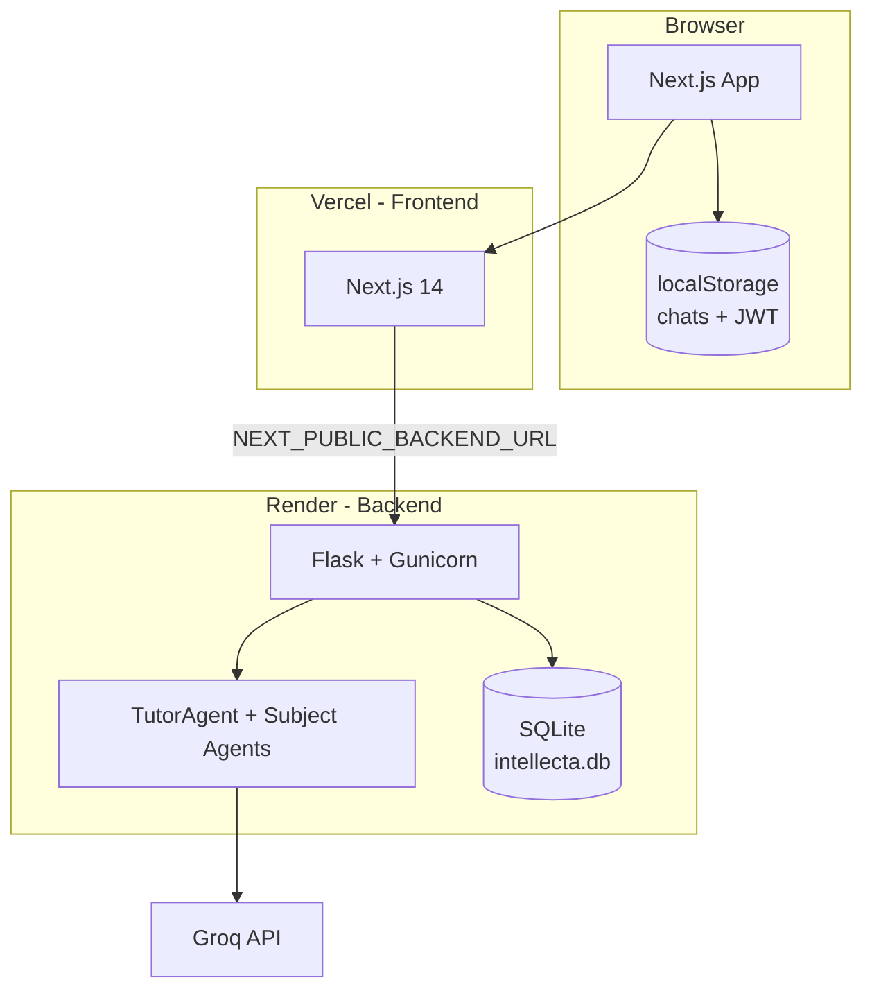

# IntellectA

**IntellectA** is a multi-agent AI study companion for students. Ask doubts in natural language, upload photos of problems from your notebook, and get step-by-step explanations with rich **LaTeX math** and chemistry notation — routed automatically to Math, Physics, Chemistry, or History specialists.

Built with a **Next.js** frontend and **Flask** backend, powered by the **Groq API**.

---

## Table of contents

- [Features](#features)
- [Architecture](#architecture)
- [Tech stack](#tech-stack)
- [Prerequisites](#prerequisites)
- [Quick start (local)](#quick-start-local)
- [Environment variables](#environment-variables)
- [Running the app](#running-the-app)
- [Deployment](#deployment)
- [API reference](#api-reference)
- [Project structure](#project-structure)
- [How routing works](#how-routing-works)
- [Data & storage](#data--storage)
- [Troubleshooting](#troubleshooting)
- [Security](#security)
- [License](#license)

---

## Features

| Area | Details |
|------|---------|
| **Smart routing** | A tutor agent classifies your question and delegates to Math, Physics, Chemistry, or History |
| **Rich answers** | Markdown + KaTeX for math; chemistry via `\ce{}` where applicable |
| **Image upload** | Send a photo of a problem; vision analysis + subject routing |
| **Authentication** | Register, login, JWT sessions (`Bearer` token) |
| **Chat UX** | Multiple chats, pin, sidebar, suggested prompts, regenerate, stop generation |
| **Themes** | Light / dark mode |
| **Landing page** | Marketing site with animated sections, testimonials, CTA |

---

## Architecture



**Production split**

- **Frontend** → [Vercel](https://vercel.com) (static/SSR Next.js)
- **Backend** → [Render](https://render.com) (Flask + Gunicorn)
- Secrets stay on the backend only; the browser never sees `GROQ_API_KEY`

---

## Tech stack

| Layer | Technologies |
|-------|----------------|
| **Frontend** | Next.js 14, React 18, TypeScript, Tailwind CSS, Framer Motion, Radix UI, KaTeX, react-markdown |
| **Backend** | Flask, Flask-CORS, Gunicorn, python-dotenv, PyJWT, Werkzeug |
| **AI** | Groq API (`llama-3.1-8b-instant` by default) |
| **Database** | SQLite (`backend/data/intellecta.db`) |
| **Auth** | JWT (HS256), bcrypt password hashes |

---

## Prerequisites

- **Node.js** 20 LTS (18+ may work; 20 recommended)
- **npm**
- **Python** 3.10+
- **Groq API key** — [console.groq.com](https://console.groq.com)

---

## Quick start (local)

```bash
git clone https://github.com/subhm2004/AI-Tutor.git
cd AI-Tutor

# Root (runs both servers)
npm install

# Backend
python3 -m venv backend/venv
backend/venv/bin/pip install -r backend/requirements.txt

# Frontend
npm --prefix frontend install
```

Create env files (see [Environment variables](#environment-variables)), then:

```bash
npm run dev
```

| Service | URL |
|---------|-----|
| Frontend | http://localhost:3000 |
| Backend | http://127.0.0.1:5000 (Flask default) |

> If your `frontend/.env.local` points to port **5001**, run the backend on that port or update the URL to match.

---

## Environment variables

### Backend — `backend/.env`

Create this file locally. **Never commit it to Git.**

| Variable | Required | Description |
|----------|----------|-------------|
| `GROQ_API_KEY` | Yes | Groq API key |
| `GROQ_MODEL` | No | Default: `llama-3.1-8b-instant` |
| `JWT_SECRET_KEY` | Yes | Long random string (32+ chars). Used to sign JWTs |
| `JWT_EXPIRE_DAYS` | No | Token lifetime in days (default: `7`) |

**Example**

```env
GROQ_API_KEY=your_groq_api_key
GROQ_MODEL=llama-3.1-8b-instant
JWT_SECRET_KEY=your_long_random_secret_at_least_32_chars
JWT_EXPIRE_DAYS=7
```

### Frontend — `frontend/.env.local`

| Variable | Required | Description |
|----------|----------|-------------|
| `NEXT_PUBLIC_BACKEND_URL` | Yes | Base URL of the Flask API (no trailing slash) |

**Local example**

```env
NEXT_PUBLIC_BACKEND_URL=http://127.0.0.1:5000
```

**Production example**

```env
NEXT_PUBLIC_BACKEND_URL=https://your-backend.onrender.com
```

> Variables prefixed with `NEXT_PUBLIC_` are embedded in the client bundle. **Do not** put `GROQ_API_KEY` or `JWT_SECRET_KEY` here.

---

## Running the app

### Option A — One command (recommended)

From project root:

```bash
npm run dev
```

Starts backend (`venv/bin/python app.py`) and frontend (`next dev`) via `concurrently`.

### Option B — Separate terminals

**Terminal 1 — Backend**

```bash
cd backend
source venv/bin/activate   # Windows: venv\Scripts\activate
python app.py
```

**Terminal 2 — Frontend**

```bash
cd frontend
npm run dev
```

### Other useful commands

```bash
# Frontend only
npm --prefix frontend run dev

# Clear Next.js cache then dev (fixes many 404 / CSS issues)
npm --prefix frontend run dev:clean

# Production build (frontend)
npm --prefix frontend run build
npm --prefix frontend run start

# Backend health check
curl http://127.0.0.1:5000/api/health
```

---

## Deployment

IntellectA deploys as **two services**. Do not put the Flask app on Vercel.

### 1) Backend — Render

1. Push code to GitHub.
2. [Render](https://render.com) → **New Web Service** → connect repo.
3. Settings:

| Setting | Value |
|---------|--------|
| **Root Directory** | `backend` |
| **Runtime** | Python 3 |
| **Build Command** | `pip install -r requirements.txt` |
| **Start Command** | `gunicorn app:app --bind 0.0.0.0:$PORT` |

4. **Environment** (dashboard, not `.env` file):

   - `GROQ_API_KEY`
   - `GROQ_MODEL`
   - `JWT_SECRET_KEY`
   - `JWT_EXPIRE_DAYS`

5. Deploy → copy your URL, e.g. `https://intellecta-qtu6.onrender.com`

6. Verify:

```bash
curl https://YOUR-BACKEND.onrender.com/api/health
# {"status":"ok","message":"IntellectA is healthy."}
```

**`backend/Procfile`** (optional on Render; Start Command above is enough):

```
web: gunicorn app:app --bind 0.0.0.0:$PORT
```

**Notes**

- `gunicorn` is listed in `backend/requirements.txt`.
- Free tier sleeps after ~15 min idle; first request may take ~50s.
- SQLite on free Render can reset on redeploy — fine for demos; use Postgres for production persistence.

---

### 2) Frontend — Vercel

1. [Vercel](https://vercel.com) → **Add Project** → same GitHub repo.
2. Settings:

| Setting | Value |
|---------|--------|
| **Root Directory** | `frontend` |
| **Framework** | Next.js |
| **Build Command** | default (`npm run build`) |
| **Install Command** | default (`npm install`) |

3. **Environment variable**

| Key | Value |
|-----|--------|
| `NEXT_PUBLIC_BACKEND_URL` | `https://YOUR-BACKEND.onrender.com` |

4. Deploy → open your `*.vercel.app` URL.

5. Test: Register → Login → Chat.

---

### Deployment checklist

- [ ] `frontend/lib/` is tracked in Git (required for Vercel; root `.gitignore` must not ignore it)
- [ ] Backend env vars set on Render
- [ ] `NEXT_PUBLIC_BACKEND_URL` set on Vercel (Production + Preview)
- [ ] Health endpoint returns `ok`
- [ ] Login and chat work on live site

---

## API reference

Base URL: `NEXT_PUBLIC_BACKEND_URL` (e.g. `http://127.0.0.1:5000`)

### Public

| Method | Path | Description |
|--------|------|-------------|
| `GET` | `/api/health` | Health check |
| `GET` | `/api/agents` | List loaded agent names |
| `POST` | `/api/auth/register` | Create account |
| `POST` | `/api/auth/login` | Login |

### Protected (header: `Authorization: Bearer <token>`)

| Method | Path | Description |
|--------|------|-------------|
| `GET` | `/api/auth/me` | Current user |
| `POST` | `/api/chat` | Text chat |
| `POST` | `/api/chat/image` | Image + optional text |

### Example — Register

```bash
curl -X POST https://YOUR-BACKEND.onrender.com/api/auth/register \
  -H "Content-Type: application/json" \
  -d '{"email":"you@example.com","password":"secret12","name":"Student"}'
```

### Example — Chat

```bash
curl -X POST https://YOUR-BACKEND.onrender.com/api/chat \
  -H "Content-Type: application/json" \
  -H "Authorization: Bearer YOUR_JWT" \
  -d '{"messages":[{"role":"user","content":"What is the derivative of x^2?"}]}'
```

---

## Project structure

```
AI-Tutor/
├── backend/
│   ├── app.py                 # Flask entrypoint
│   ├── Procfile               # Gunicorn (Heroku/Railway-style hosts)
│   ├── requirements.txt
│   ├── .env                   # Local secrets (gitignored)
│   ├── data/                  # SQLite DB (gitignored)
│   ├── auth/                  # JWT routes, decorators
│   ├── agents/                # Tutor + Math/Physics/Chem/History
│   ├── services/              # Image vision
│   └── database.py
├── frontend/
│   ├── app/                   # Next.js App Router pages
│   ├── components/            # UI, chat, landing, brand
│   ├── lib/                   # auth helpers, utils (must be in Git!)
│   ├── utils/                 # API clients
│   ├── types/
│   └── .env.local             # Local frontend env (gitignored)
├── package.json               # `npm run dev` for both services
├── SETUP.md                   # Extended troubleshooting
└── README.md
```

---

## How routing works

1. User sends a message in chat.
2. **`TutorAgent`** reads the conversation and classifies the subject (Math, Physics, Chemistry, History, or general).
3. The matching **subject agent** generates the answer with subject-specific system instructions.
4. For **images**, vision analysis runs first, then routing + answer generation.
5. Response includes agent metadata for display in the UI.

---

## Data & storage

| Data | Where |
|------|--------|
| User accounts | SQLite `backend/data/intellecta.db` |
| JWT token | Browser `localStorage` (`intellecta-token`) |
| Chat history | Browser `localStorage` per user (`intellecta-chats-{userId}`) |
| Legacy keys | Auto-migrated from `ai-tutor-*` keys |

Chat threads are **not** synced to the server yet — clearing browser data removes local chats.

---

## Troubleshooting

| Problem | Fix |
|---------|-----|
| `Can't resolve '@/lib/auth'` on Vercel | Ensure `frontend/lib/` is committed; root `.gitignore` must not use bare `lib/` |
| `/_next/static/...` 404 | Stop dev → `rm -rf frontend/.next` → `npm run dev` → hard refresh browser |
| Backend won't start | Recreate venv: `rm -rf backend/venv && python3 -m venv backend/venv` then reinstall requirements |
| Chat 401 | Log in again; check `JWT_SECRET_KEY` matches between deploys |
| CORS / network errors | Confirm `NEXT_PUBLIC_BACKEND_URL` is correct `https` URL |
| Slow first request on Render | Free tier cold start — wait and retry |

More detail: **[SETUP.md](./SETUP.md)**

---

## Security

- Keep `backend/.env` and API keys **out of Git**
- Rotate `GROQ_API_KEY` if it was ever exposed
- Use a strong `JWT_SECRET_KEY` in production
- `NEXT_PUBLIC_*` vars are visible in the browser — only put public URLs there
- For production, consider restricting CORS to your Vercel domain instead of `*`

---

## Author

**Shubham** — [github.com/subhm2004](https://github.com/subhm2004)

If this project helped you, star the repo and share feedback via issues.
